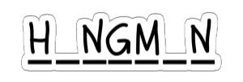

<!-- README file in MD for my Hangman repository-->
<a name="readme-top"></a>
<!--
*** Attribution and thanks: README template adapted from Othneil Drew's example, available at:
*** https://github.com/othneildrew/Best-README-Template
-->


<!-- PROJECT LOGO -->
<p align="center">
  
  <br>
   Interactive hangman word game.
</p>


<!-- SHIELDS FOR REPO -->
<p align="center">
    <a>
        </a>
    <a>
        </a>
</p>


<!-- TABLE OF CONTENTS -->
<details>
  <summary>Table of Contents</summary>
  <ol>
    <li>
      <a href="#about-the-project">About The Project</a>
    </li>
    <li>
      <a href="#installation">Installation</a>
      <ul>
        <li><a href="#clone-repo">Step 1: Clone the Repository</a></li>
        <li><a href="#setup-env">Step 2: Setup the Environment</a></li>
      </ul>
    </li>
    <li>
      <a href="#usage">Usage</a>
        <ul>
          <li><a href="#playing-the-game">Playing the Game</a></li>
          <li><a href="#list-of-available-words-to-guess">List of Available Words to Guess</a></li>
        </ul>
    </li>
    <li>
      <a href="#file-structure">File Structure</a>
    </li>
    <li><a href="#license">License</a></li>
  </ol>
</details>


<!-- ABOUT THE PROJECT -->
## About the Project

Hangman is a classic game in which a player thinks of a word and the other player tries to guess that word within a certain amount of attempts.

This is an implementation of the Hangman game, where the computer thinks of a word and the user tries to guess it. 

### Win and Lose Conditions
- **Win conditions:** User guesses the word.
- **Lose conditions:** User loses all lives (5 lives by default).

<!-- Installation -->
## Installation

<a name="clone-repo"></a>

### Step 1: Clone the repository

For this step, we recommend cloning the repository using `Git`. If you do not have Git installed in your machine, check the resources [here][url-installing-git].

1. Open a command prompt.
2. Change the current working directory to the location where you want the cloned directory.
3. Type git clone, and then paste the URL for the Github repository.
    ```sh
    git clone https://github.com/pili-zhangqiu/hangman.git
    ```

---

<a name="setup-env"></a>

### Step 2: Setup the environment

This project only uses Python in-built modules, and as such you will not need to install any third-party libraries.

If you don't have Python, you can find more information on how to install it [here][url-installing-python].

<a href="https://wiki.python.org/moin/BeginnersGuide/Download" rel="Python Installation Guide">
  
</a>


<p align="right">(<a href="#readme-top">back to top</a>)</p>


<!-- USAGE -->
## Usage

### Playing the Game

If you followed the previous steps on installation, you should be able to run the `hangman.py` script to start the game:

1. Open a command prompt. 
3. Navigate to the directory where the example script is located. 
4. Use the python method to run the example script.
    ```sh
    python hangman.py
    ```

### List of Available Words to Guess

This project uses a preset list of available words to be guessed. These are defined in the `hangman.py` script as follows:

```python
if __name__ == '__main__':
    # Declare a list of available words to be guessed
    word_list = ['apple', 'banana', 'orange', 'pear', 'strawberry', 'watermelon']

    # Start the hangman game
    play_game(word_list)
```

If you want to expand this list, you can modify the lines of code shown above.

<p align="right">(<a href="#readme-top">back to top</a>)</p>


<!-- FILE STRUCTURE -->
## File Structure

Overall, this project is contained within a single `hangman.py` script. This script contains the `Hangman` class, but can also be called directly to play the game.

The repository structure is as follows:
```sh
hangman/
├─ node_modules/
├─ src/
│  ├─ hangman.py
├─ img/
│  ├─ hangman_logo_transparent.png
├─ .gitignore
├─ LICENSE.txt
├─ README.md
```

<p align="right">(<a href="#readme-top">back to top</a>)</p>

<!-- LICENSE -->
## License

Distributed under the Apache 2.0 License. See `LICENSE.txt` for more information.

<p align="right">(<a href="#readme-top">back to top</a>)</p>


<!-- MARKDOWN LINKS & IMAGES -->
<!-- https://www.markdownguide.org/basic-syntax/#reference-style-links -->
[url-installing-git]: https://git-scm.com/book/en/v2/Getting-Started-Installing-Git
[url-installing-python]: https://wiki.python.org/moin/BeginnersGuide/Download
